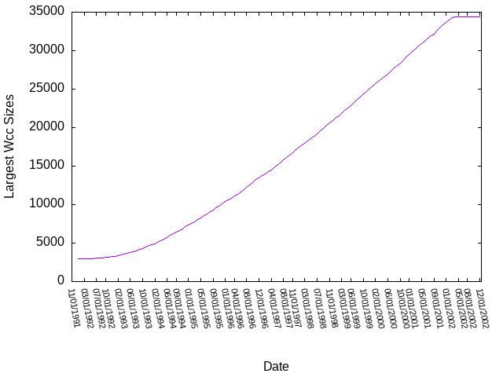

# Analysis of High-Energy Physics citation network
> http://snap.stanford.edu/data/cit-HepPh.html

## Some properties plotted over time

### Strongly Connected Components

  
  

- It is interesting to note that the graph has only one big SCC, while the rest
  of the nodes are in components of size strictly less than 12. 
- This indicates that this citation network has one mainstream sub-field
  (papers which are part of the large SCC), and the rest of the papers are
  sparse sub-fields with ongoing research disconnected from the mainstream
  branch.
- The number of strongly connected components peaks around 2001. This can be
  attributed to the number of sub-fields being saturated. After this point, the
  frequency of papers linking different sub-fields together increases, which
  leads to the merging of different SCCs together.

### Weakly Connected Components

  
  

TO DO: PUT THE CENTRALITY MEASURES HERE

## Community Detection

Since the graph has one big SCC and a large number of scattered smaller
components, we will only be performing community detection on the large SCC and
ignore the scattered components.

### Girwan-Newman 

#### Directed Graph

- We will restrict our discussion to the years 1999 and later, due to the fact
  that [the graph is heavily disconnected before
  that](#strongly-connected-components).
- The case of the directed graph is particularly uninteresting, as there is
  only one large community at all times. Girwan-Newman removes the edge with
  the highest betweenness centrality, and doing so for the directed graph
  results in the same community, but with one less node.

#### Undirected Graph
