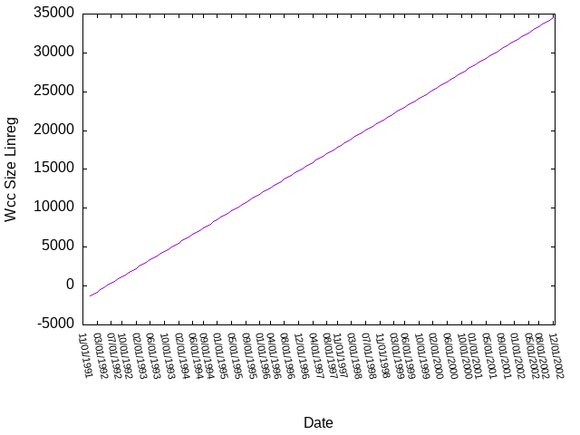

# Analysis of High-Energy Physics citation network
> http://snap.stanford.edu/data/cit-HepPh.html

## Some properties plotted over time

### Strongly Connected Components

  
  

- It is interesting to note that the graph has only one big SCC, while the rest
  of the nodes are in components of size strictly less than 12. 
- This indicates that this citation network has one mainstream sub-field
  (papers which are part of the large SCC), and the rest of the papers are
  sparse sub-fields with ongoing research disconnected from the mainstream
  branch.
- The number of strongly connected components peaks around 2001. This can be
  attributed to the number of sub-fields being saturated. After this point, the
  frequency of papers linking different sub-fields together increases, which
  leads to the merging of different SCCs together.

### Weakly Connected Components

  
  

- As expected, the saturation point in case of WCCs occurs much earlier (around
  1993) than that of SCCs.
- After this, any one way linkage between two sub-fields causes a merge in
  between the two WCCs, thus we observe a rapid decline in the number of WCCs
  after this.
- Surprisingly, the size of the largest WCC increases almost linearly along with time.
- On performing linear regression on this, we get an R2 score of 97%, verifying that the trend is indeed linear.

    

- This can be used to predict the size of the largest WCC at arbitrary times.

### Degree Centrality

  
  

### Indegree Centrality

  
  

### Outdegree Centrality

  
  

### Betweenness Centrality

  
  

## Community Detection

Since the graph has one big SCC and a large number of scattered smaller
components, we will only be performing community detection on the large SCC and
ignore the scattered components.

### Girwan-Newman 

#### Directed Graph

- We will restrict our discussion to the years 1999 and later, due to the fact
  that [the graph is heavily disconnected before
  that](#strongly-connected-components).
- The case of the directed graph is particularly uninteresting, as there is
  only one large community at all times. Girwan-Newman removes the edge with
  the highest betweenness centrality, and doing so for the directed graph
  results in the same community, but with one less node.

#### Undirected Graph
- The undirected graph results in interesting communities, but the algorithm is far too slow to run completely.
- Parallelizing Girwan-Newman over multiple threads resulted in a 4.9x speedup, which made community detection uptil 1995 feasible.

  
  

  
  

> 1992 (top left), 1993 (top right), 1994 (bottom left), 1995 (bottom right)
